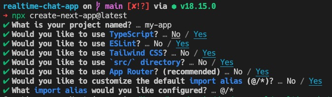

# Realtime Chat App

> Build and Deploy a Full Stack Realtime Chat Messaging App with NextJS 13 with the help of [JavaScript Mastery](https://www.youtube.com/watch?v=NlXfg5Pxxh8&ab_channel=Joshtriedcoding)

## Boilerplate

```bash
npx create-next-app@latest
```



## Other Packages

- [CVA (Class Variance Authority)](https://github.com/joe-bell/cva)
- [tailwind-merge](https://github.com/compi-ui/tw-merge)
- [clsx](https://github.com/lukeed/clsx)
- [Lucide (icons)](https://github.com/lucide-icons/lucide)
